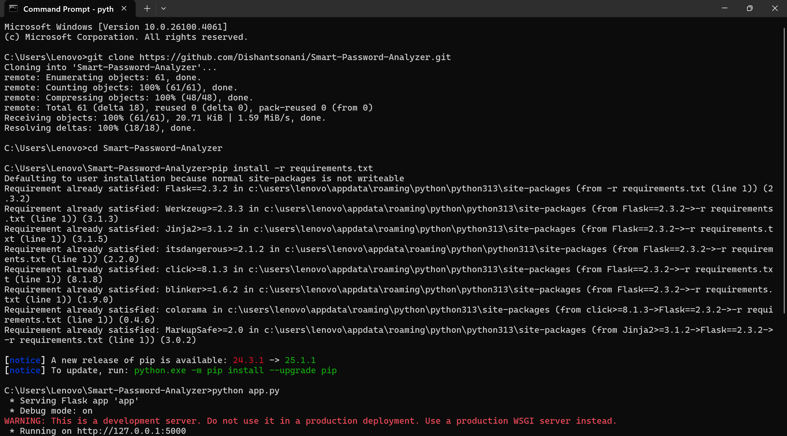
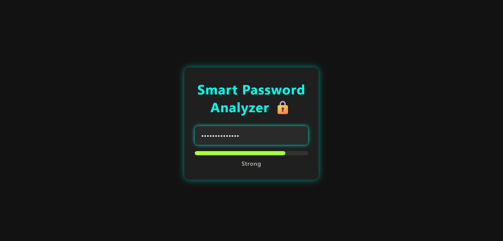

# 🔐 Smart Password Analyzer  
**Analyze Your Passwords Instantly for Strength and Security!**

  


## 🌟 Project Overview

In today’s digital age, strong passwords are your first line of defense. The **Smart Password Analyzer** is a clean, real-time web app that evaluates password strength dynamically, helping users create secure passwords with immediate feedback.

Built with **Flask**, it offers a smooth UI with an animated strength meter and straightforward insights based on length, complexity, and common weak password patterns.

---

## ✨ Why This Tool?

- **⚡ Real-Time Feedback**: Analyze password strength instantly as you type.
- **🔍 Detailed Analysis**: Checks length, character variety, and common weak patterns.
- **🎨 Modern UI**: Neon-themed, minimalistic design for a smooth user experience.
- **💻 Cross-Platform**: Runs locally on any system with Python and Flask installed.
- **📦 Lightweight**: Simple dependencies for easy setup and customization.

---

## 🎬 How It Works on windows

### 1. Clone the Repository:
```bash
git clone https://github.com/Dishantsonani/Smart-Password-Analyzer.git
cd Smart-Password-Analyzer
```

### 2. (Optional) Set Up Virtual Environment:
```bash
python -m venv venv
source venv/bin/activate   # Windows: venv\Scripts\activate
```

### 3. Install Dependencies:
```bash
pip install -r requirements.txt
```

### 4. Run the Flask App:
```bash
python app.py
```

### 5. Open in Browser:
Visit [http://127.0.0.1:5000](http://127.0.0.1:5000) and start typing your passwords!

---
Sure! Here’s how you can **run your Smart Password Analyzer project on Kali Linux** — I’ll add the Kali-specific instructions to your existing README style.

---

## 🐧 How to Run on Kali Linux

If you want to run **Smart Password Analyzer** on **Kali Linux**, follow these steps:

### 1. Open Terminal

### 2. Clone the Repository

```bash
git clone https://github.com/Dishantsonani/Smart-Password-Analyzer.git
cd Smart-Password-Analyzer
```

### 3. (Optional) Create & Activate Virtual Environment

```bash
python3 -m venv venv
source venv/bin/activate
```

### 4. Install Dependencies

```bash
pip3 install -r requirements.txt
```

### 5. Run the Flask Application

```bash
python3 app.py
```

### 6. Open your web browser and visit:

```
http://127.0.0.1:5000
```

---

**Notes:**

* Kali Linux typically comes with both Python 2 and Python 3, so use `python3` and `pip3` explicitly to avoid version conflicts.
* If `python3-venv` is not installed, install it with:

  ```bash
  sudo apt update
  sudo apt install python3-venv
  ```
* You may need to install `pip3` if missing:

  ```bash
  sudo apt install python3-pip
  ```

---

## 🖼️ Project Snapshots

### 🎯 How It Runs



This snapshot shows the project *in action*! It demonstrates how the real-time strength meter works as the user types input. With vibrant neon effects and smooth animations, the app gives instant feedback and brings an engaging, futuristic user experience.

---

### 💻 User Interface



This is the static webpage interface of the project. It features a clean, modern layout with glowing colors and soft transitions. The UI design focuses on clarity, responsiveness, and visual appeal — making it both attractive and easy to use.


---

## 🌍 Folder Structure
```bash
Smart-Password-Analyzer/
├── static/
│   ├── css/
│   │   └── styles.css
│   └── js/
│       └── script.js
├── templates/
│   └── index.html
├── app.py
├── password_utils.py
├── requirements.txt
├── README.md
└── .gitignore
```

---

## 👨‍💻 Tech Stack

- **Python 3.8+**
- **Flask 2.3.2**
- **HTML5, CSS3, JavaScript**
- **No external dependencies except Flask**

---

## ⚙️ Installation & Setup

Follow the steps in “How It Works” above.  
Make sure Python 3.8 or higher is installed on your system.

## 👏 Credits

- **Flask** — The Python web framework powering this app.  
- **All contributors** — For ideas, code, and testing.

---

## 📄 License

This project is licensed under the MIT License. See [LICENSE](LICENSE) for details.

---

## 🔒 Strengthen Your Security!  
**Smart Password Analyzer** helps you build better passwords with instant, actionable feedback—because strong passwords matter.
